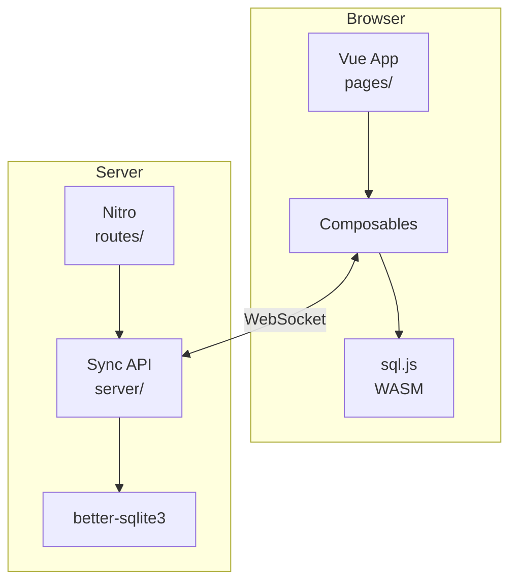
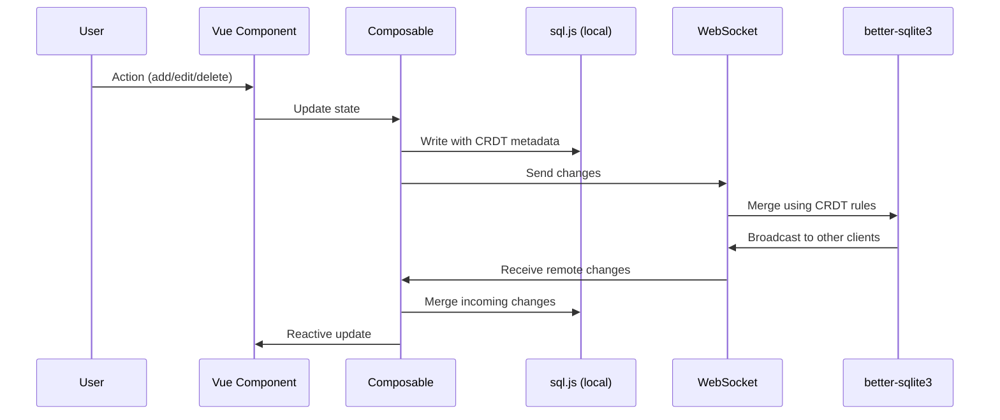
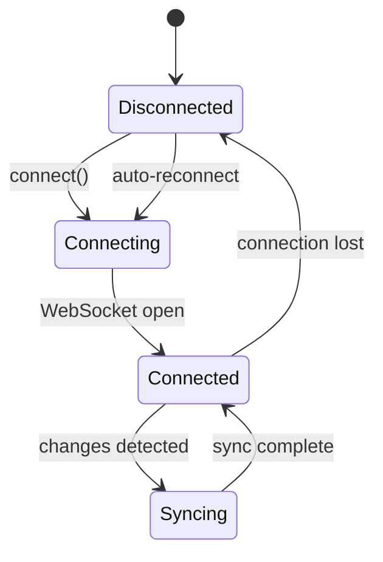

# System Knowledge Map

## Architecture Overview

## Data Flow

## Sync Protocol Flow

## Key Files

| File | Purpose |
|------|---------|
| `utils/co.ts` | CRDT operations - conflict resolution logic |
| `utils/sync-protocol.ts` | WebSocket sync protocol |
| `utils/schema.ts` | Shared database schema |
| `server/routes/` | WebSocket handlers |
| `server/database/` | Server-side SQLite setup |
